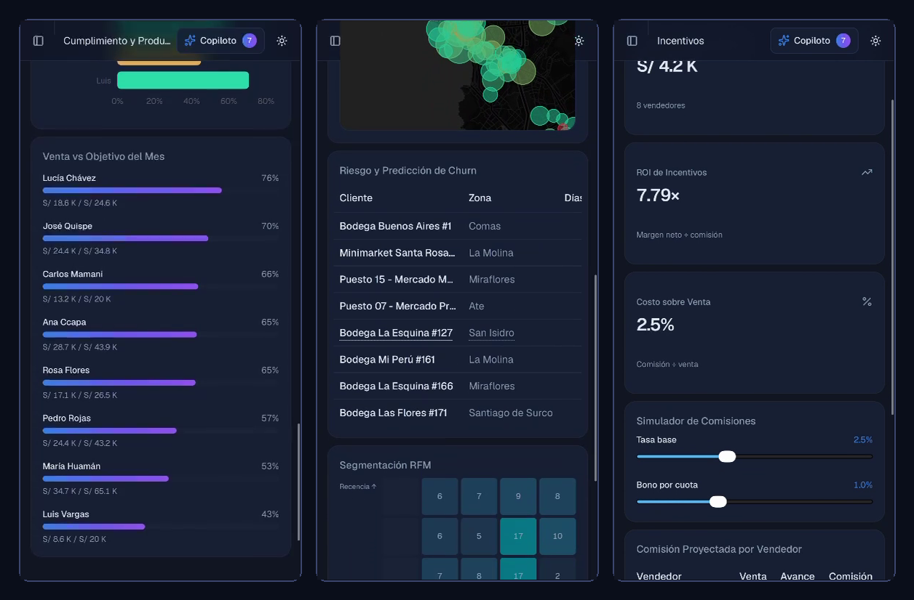

# Yanaliza — Smart Data Platform

> **Commercial intelligence, made simple.** Yanaliza turns a company's own sales data into its biggest competitive advantage — through smart dashboards, an AI copilot, and actionable alerts.

🔗 **Live demo:** [demo.yanaliza.com](https://demo.yanaliza.com/)

## What it does

Yanaliza gives commercial leaders the analytics power of a full data team, without needing one:

- 📊 **Smart dashboards** — sales vs. targets, rep productivity, product performance by category and rotation
- 🤖 **AI Copilot** — ask questions about your business in natural language, get answers grounded in your own data
- 🔔 **Actionable alerts** — churn risk prediction per client and zone, so teams act before losing the account
- 🗺️ **Geo intelligence** — client mapping across zones to focus field execution
- 🎯 **RFM segmentation** — know which clients to grow, retain, or recover
- 💸 **Incentives engine** — commission simulator and incentive ROI tracking for sales teams

## Mission & vision

**Mission:** empower business leaders with agile, deep intelligence so they make profitable decisions with confidence — turning their own data into their biggest competitive advantage.

**Vision:** become the leading LATAM platform that democratizes business intelligence for commercial companies and B2B channels, professionalizing execution across the whole value chain.

## My role — Founder

I lead the product end to end:

- **Product & vision** — defining what Yanaliza is and the problems it solves
- **Data & analytics design** — the metrics, models, and insights the platform delivers
- **Go-to-market** — positioning, pricing, and early customer development

Engineering is led by our development partner; the application code lives in a private repository. This repository is the product showcase.

## Status

| | |
|---|---|
| Stage | Working demo / early access |
| Market | Peru → LATAM |
| UI language | Spanish |

## Contact

Interested in the product or a demo? Reach me at **rodrigoodar1303@gmail.com** · [LinkedIn](https://www.linkedin.com/in/r-odar1303)
